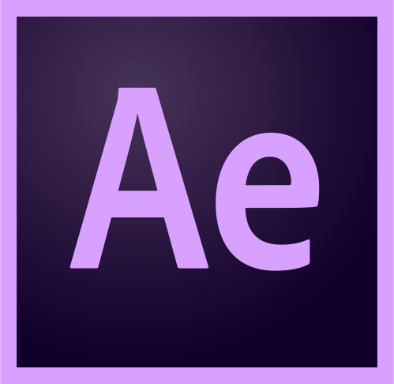

<h1 align="center">🎨 Hour Of Design</h1>

"You can't use up creativity. The more you use the more you have." -- Maya Angelou

<h2 id="Contents"> 📕 Table Of Contents </h2>

 * Apps
    * [Planets App](#PlanetsApp)

<h3 id="PlanetsApp">Planets App</h3>

